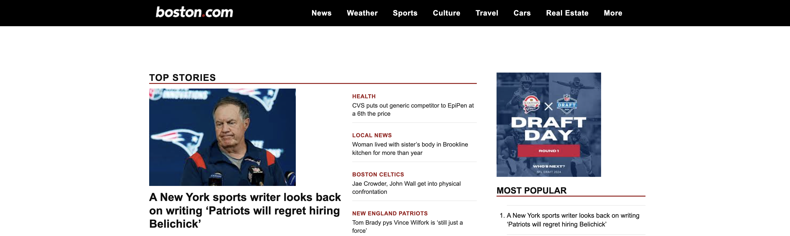

# Boston.com Clone  

  
<!-- Replace with an actual screenshot of your app -->

**A front-end clone of the Boston.com news site.**  
A project built to practice responsive layouts, typography, and content structuring by recreating the look and feel of a major news site.  

---

## Live Demo  
[Click here to view](https://your-boston-clone-link.netlify.app)  
<!-- Replace with your actual Netlify URL -->

---

## Tech Stack  
- HTML / CSS / JavaScript  
- Vercel (Deployment)  

---

## Features  
- Recreation of Boston.com homepage layout  
- Responsive design for desktop and mobile  
- Focus on grid-based layouts, typography, and imagery  
- Practice project for front-end structure and styling  

---

